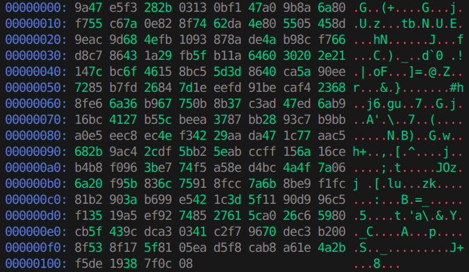

# H3xpeek

h3xpeek is a small command-line utility for inspecting binary files in a human-readable format. It prints file contents as hexadecimal bytes alongside their ASCII representation, making it easy to analyze raw data.

The tool is inspired by the classic Unix utility [xxd](https://linux.die.net/man/1/xxd), a widely used hex dump tool.

## Disclaimer

Even though the program aims to be useful, it is distributed under the MIT License WITHOUT WARRANTIES OR CONDITIONS OF ANY KIND.
The users are solely responsible for determining the appropriateness of using or redistributing the Work and assume any risks associated with their exercise of permissions under the License.

## Preview

